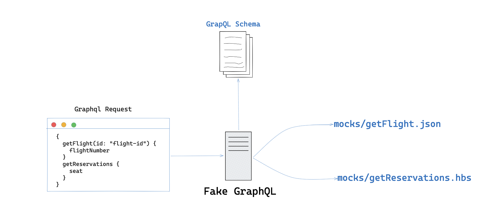

<h1 align="center">Fake GraphQL</h1
<p align="center">Mock your GraphQL API with the power of the filesystem</p>



Fake GraphQL is a tool that allows you to mock your GraphQL API with the power of the filesystem. It uses fakerjs to generate random data and handlebars as a template engine. The goal is to make it easy to create a mock server with zero configuration and zero code. It is useful for mocking out a GraphQL server during development or testing.

## Features

- Zero configuration (just run `fake-graphql graphql -s schema.graphql`)
- Zero code (no need to write any code)
- File system based mocks
- Easily generate sample data using [fakerjs](https://fakerjs.dev/)
- Use [handlebars](https://handlebarsjs.com/) to generate complex data

## Quick Start

Quickly start the server with a simple hello world example.

```bash
echo "Hello, {{faker 'person.firstName'}}" > hello.hbs
echo type Query { hello: String } > schema.graphql

npx @raysca/fake-graphql graphql
```

The graphql server will be running on http://localhost:8080/api/graphql with a
playground to test it out.

## Server Options

| Option                  | Description                                  | Default           |
| ----------------------- | -------------------------------------------- | ----------------- |
| `-s, --schema <schema>` | Path to the graphql schema file.             | current directory |
| `-m, --mocks <mocks>`   | Path to the mocks directory.                 | current directory |
| `-p, --port <port>`     | Port to run the server on.                   | 8080              |
| `-e, --endpoint`        | The graphql endpoint will be accessible from | /api/graphql      |
| `-w, --watch`           | Reload server if schema/mocks changes        | false             |

```bash
Usage: fake-graphql graphql --help
```

## How it works

Each graphql operation is mapped to a file in the `mocks` directory.
`Fake GraphQL` matches the operation name to a file in the `mocks` directory. For
example, if the operation name is `hello` then `Fake GraphQL` will look for a
file called `hello.hbs` in the `mocks` directory. If the file exists then it
will be used to generate the response. If the file does not exist then a default
response will be returned.

## Examples

Here is an example graphql schema:

```graphql
type Query {
  getPerson: Person
  people: [Person]
}

type Person {
  name: String
  phone: String
}
```

Here is an example `mocks/getPerson.hbs` file:

```text
{
    "name": "{{faker 'person.firstName'}} {{faker 'person.lastName'}}",
    "phone": "{{faker 'phone.phoneNumber'}}"
}
```

Here is an example `mocks/people.hbs` file:

```text
[
{{#repeat 2}}
    {
        "name": "{{faker 'person.firstName'}} {{faker 'person.lastName'}}",
        "phone": "{{faker 'phone.phoneNumber'}}"
    }
{{/repeat}}
]
```

## Advance Templates and Helpers

Whilst `Fake GraphQL` supports simple JSON file based mocks, the power of the server shines when combined with handlebars templates and helpers.

The sever has a number of built-in helpers to make it easy to generate random data. Here are the built-in helpers:

### faker

[fakerjs](https://fakerjs.dev/). It takes a single argument which is the name of
The `faker` helper is used to generate random data using
the faker method to call. For example:

```text
{{faker 'person.firstName'}}
{{faker 'lorem.lines' min=3 max=5 }}
{{faker "string.alphanumeric" 5}}
```

All the faker methods are supported. See the [fakerjs](https://fakerjs.dev/)

### random

The `random` helper is used to select a random value from a list of values. For
example:

```text
{{random 'a' 'b' 'c'}}
```

### repeat

The `repeat` helper is used to repeat a comma-separated block of code a number
of times. This is good for generating arrays of values For example:

```text
[
{{#repeat 2}}
    {
        "applicable": true,
        "code": "CODE-{{faker "string.alphanumeric" 5}}"
    }
{{/repeat}}
]
```

### for

The `for` helper is used to repeat a block of code a number of times. It is
useful for generating a list of of values For example:

```text
{{#for 0 10}}
   INSERT INTO test-table (id, name) VALUES ('{{faker "string.alphanumeric" 5}}', '{{faker 'person.firstName'}}')
{{/for}}
```

Also see the [examples](examples) directory for more examples.
