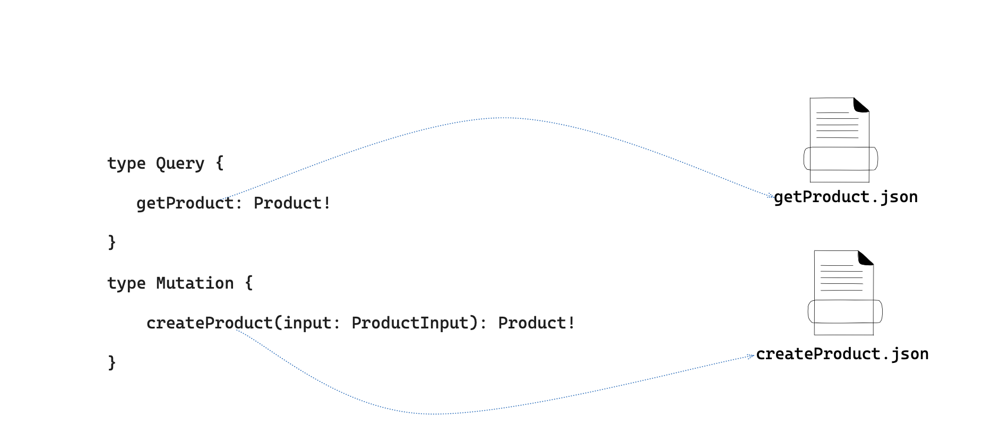

<h1 align="center">Fake GraphQL</h1
<p align="center">Effortless GraphQL Mocking using the filesystem</p>

Elevate your development experience with an innovative mock server, seamlessly
powered by filesystem integration, dynamic
[Handlebars](https://handlebarsjs.com/) templating, and realistic data
generation with [Faker.js](https://fakerjs.dev/)


## Benefits of using Fake GraphQL over other mock servers

- **No code changes**. Just point your code to the mock server
- **File system based mocks**. Easily create, edit and version mocks alongside
  your code
- **Dynamic and complex mocks**. Use [handlebars](https://handlebarsjs.com/) to
  create dynamic and complex mocks
- **Realistic data**. Easily generate sample data using [fakerjs](https://fakerjs.dev/)
- **Zero configuration**. Just run `fake-graphql graphql -s schema.graphql`

## Quick Start

Quickly start the server with a simple hello world example.

```bash

# Create a mocks directory
mkdir mocks

# Create a simple graphql schema
echo type Query { hello: String } > schema.graphql

# Create a simple handlebars template
echo "Hello, {{faker 'person.firstName'}}" > mocks/hello.hbs

npm exec @raysca/fake-graphql graphql
```

The graphql server will be running on http://localhost:8080/api/graphql with a
playground to test it out.

## Server Options

| Option           | Description                                                     | Default           |
| ---------------- | --------------------------------------------------------------- | ----------------- |
| `-s, --schema`   | Path to the graphql schema file.                                | current directory |
| `-m, --mocks`    | Path to the mocks directory containing `.hbs` or `.json` files. | current directory |
| `-p, --port`     | Port to run the server on.                                      | 8080              |
| `-e, --endpoint` | The graphql endpoint will be accessible from                    | /api/graphql      |
| `-w, --watch`    | Reload server if schema/mocks changes                           | false             |

```bash
Usage: fake-graphql graphql --help
```

## How it works



There is a one-to-one mapping between graphql operations and mock files. This makes mocking intuitive and easy to understand. No complex configuration or code changes are required.

The server will look for a mock file in the mocks directory that matches the requested graphql operation. For example, if the graphql operation is `getPerson` then the server will look for a file called `getPerson.hbs` or `getPerson.json` in the mocks directory.

## Examples

Here is an example graphql schema:

```graphql
type Query {
  getPerson: Person
  people: [Person]
}

type Person {
  name: String
  phone: String
}
```

Here is an example `mocks/getPerson.hbs` file:

```text
{
    "name": "{{faker 'person.firstName'}} {{faker 'person.lastName'}}",
    "phone": "{{faker 'phone.phoneNumber'}}"
}
```

Here is an example `mocks/people.hbs` file:

```text
[
{{#repeat 2}}
    {
        "name": "{{faker 'person.firstName'}} {{faker 'person.lastName'}}",
        "phone": "{{faker 'phone.phoneNumber'}}"
    }
{{/repeat}}
]
```

## Advance Templates and Helpers

Whilst `Fake GraphQL` supports simple JSON file based mocks, the power of the
server shines when combined with handlebars templates and helpers.

The `Fake GraphQL` server has a number of built-in helpers to make it easy to generate random
data and more complex mocks. Here are the built-in helpers:

### faker

`faker` is used to generate random sample data in templates . It takes the fakerjs method as a parameter for example:

```json
{
  "firstName": "{{faker 'person.firstName'}}",
  "lastName": "{{faker 'person.lastName'}}",
  "phone": "{{faker 'phone.number'}}",
  "email": "{{faker 'internet.email'}}",
  "weight": "{{faker 'number.float' min=100 max=200}}kg"
}
```

All the faker methods are supported. See the [fakerjs](https://fakerjs.dev/)

### random

The `random` helper is used to select a random value from a list of values. For
example:

```text
{{random 'a' 'b' 'c'}}
```

### repeat

The `repeat` helper is used to repeat a comma-separated block of code a number
of times. This is good for generating arrays of values For example:

```text
[
{{#repeat 2}}
    {
        "applicable": true,
        "code": "CODE-{{faker "string.alphanumeric" 5}}"
    }
{{/repeat}}
]
```

Also see the [examples](examples) directory for more examples.